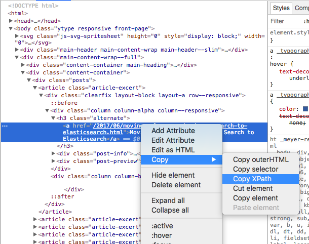

# Contribution 简介

首先，非常感谢各位对**Eblo**的支持，有你的参与，**Eblo**一定会变的越来越好。

**Eblo**致力于能更好的为阅读工程博客或者泛博客类网页的阅读提供便利，即可以有客户端来直接看博客更新，又可以提供API供感兴趣的人来进行二次开发。

## 解析源的贡献

我会把目前这个工程所支持的所有的解析源在Readme中列出来，解析源的贡献是最重要的一个，更多的博客解析会让Eblo内容更丰富更好用。

### 1. 运行EbloVaporServer

首先,你需要把**EbloVaporServer**这个project在本地运行起来，Readme里有详细说明。成功运行后，请用浏览器检查http://localhost:8080/blog/article
来看一下是否有文章解析结果。你也可以看`Xcode`的`console`来确认，文章得到解析后会有相应的log输出。

### 2. XPath解析

整个博客的解析，是根据在html中寻找想要的Element的XPath来实现的，所以需要对XPath有一定的了解。这个网上也有很多[tutorial](https://www.w3schools.com/xml/xpath_syntax.asp)可以查阅。

推荐使用Chrome进行页面元素XPath的查找，打开一个网页后，使用快捷键`cmd+opt+J`就可以打开开发者模式来浏览，点击左上角的element tab ,然后
你可以使用点击工具来选择想要查看的元素，然后在你的`console`中分析XPath，你可以使用chrome提供的工具，但是跟认为那个是辅助，因为它找到的是全路径，
html依赖很严重，如果一有变动可能就不好使了，最好是使用general的XPath解析路径。

<h3 align="center">
    
</h3>

找到了相关元素XPath以后，就可以把信息规整起来，然后创建一个json的object，这个object就包含了一个博客解析所需要用到的内容。比如yelp的信息如下：

```JSON
{ "name": "yelp",
  "baseURL": "https://engineeringblog.yelp.com/",
  "basedOnBase": true,
  "title": "//article//h3//a",
  "href": "//article//h3//a/@href",
  "author": "//article//div[@class='post-info']//img/@alt",
  "authorAvatar": "//article//div[@class='post-info']//img/@src",
  "date": "//article//div[@class='post-info']//li[@class='post-date']",
  "nextPage": "//div[@class='pagination-block']//div[@class='arrange_unit']//a[@class='u-decoration-none next pagination-links_anchor']/@href"
 }
```

下面这个表格来解释每个json的object需要哪些信息，例子是[Yelp](https://engineeringblog.yelp.com/)
   
   key    |  content | 备注   | 是否必需 |
--------- |  ------- | ----- |  ----- |
 name     | yelp     | 公司名 | **是**
 baseURL  | https://engineeringblog.yelp.com/    | 博客地址  | **是**
 title    | //article//h3//a | Blog的title的XPath | **是**
 href     | //article//h3//a/@href| Blog的超链接地址XPath |  **是**
 basedOnBase     | true     | href XPath找到的href是否是相对地址，如果是相对地址(eg./2017/06/abc.html)，则需要拼接baseURL，这时应该添加这个key并且设置为true | **否**
 href     | //article//h3//a/@href| Blog的超链接地址XPath **是**
 author    | //article//div[@class='post-info']//img/@alt | Blog作者的XPath | **否**
 authorAvatar    | //article//div[@class='post-info']//img/@src | Blog作者头像的XPath | **否**
 date    | //article//div[@class='post-info']//li[@class='post-date'] | Blog发表日期的XPath，最好有 | **否**
 nextPage    | //div[@class='pagination-block']//div[@class='arrange_unit']//a[@class='u-decoration-none next pagination-links_anchor']/@href | 下一页要解析的Page的XPath，为了能解析更多历史的blog这个最好有 | **否**

当你完成上面的一个公司的全部信息，创建好这个工程以后，你可以测试一下你的JSON信息是否能够正确解析，方法如下

```SWIFT
// 把你的json拷贝到 SupportingFiles下的newCompany.json,注意只要把公司替换就好了，那个json文件里的company key是root不要换掉，检查你的json文件是否是valid的json

// 在EnvironmentManager里
static let local: Bool = true
static let newCompany: Bool = true
```
清空数据库后重新运行，你可以通过`console`的log来检查你的输入是否正确。

### 3. 创建PR

把你的`newCompany.json`的内容做一个PR，测试审核通过以后，会merge到`company.json`中。
